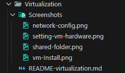
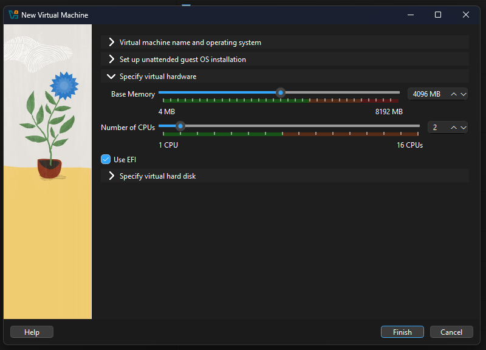
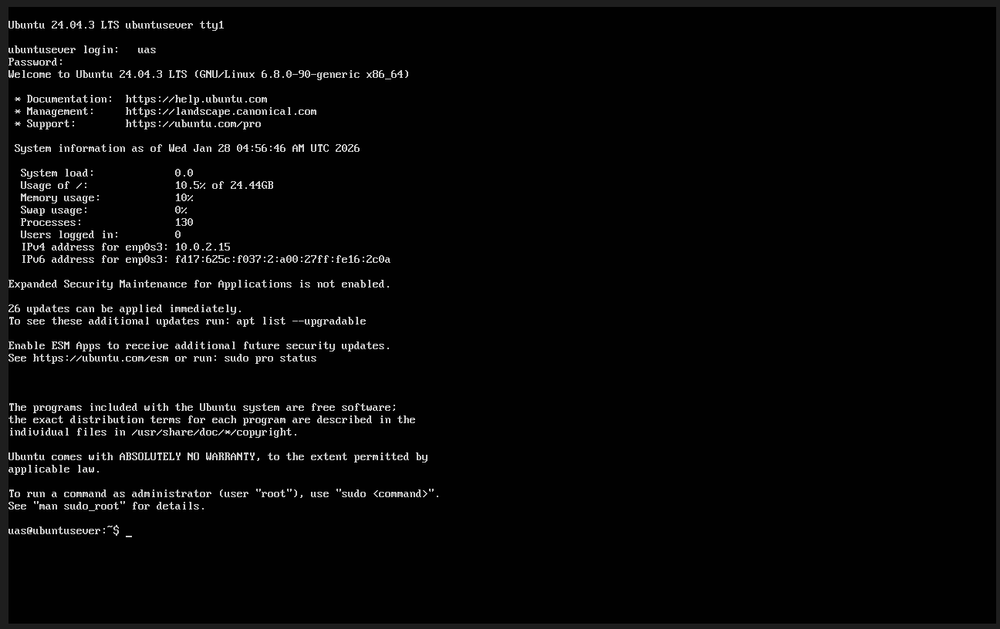
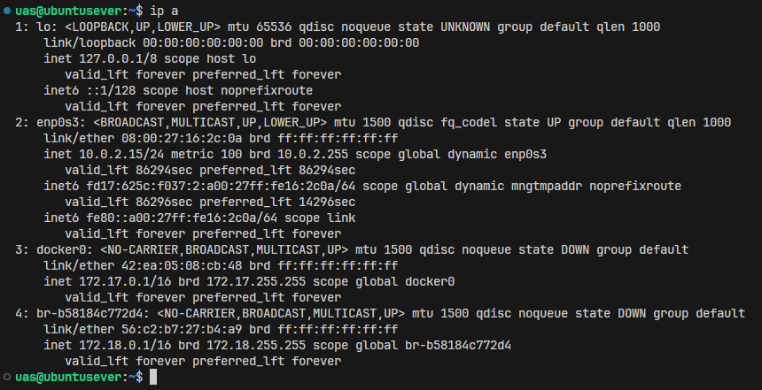
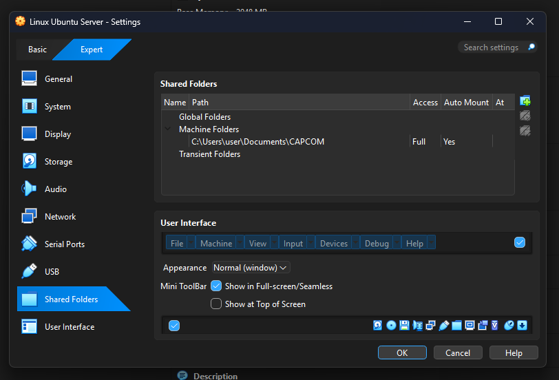

# Dokumentasi Implementasi Virtualization - UAS Sistem Operasi

Di bagian ini mendokumentasikan proses instalasi dan konfigurasi Sistem Operasi menggunakan teknologi **Virtual Machine (VM)** melalui software Oracle VM VirtualBox.

---

## 📂 Struktur Folder Dokumentasi

Berdasarkan folder `Virtualization`, berikut adalah aset pendukung yang tersedia:

- **`Screenshots/`**:
  - `folder-structure.png`: Struktur folder
  - `vm-Install.png`: Dokumentasi tahap awal instalasi Sistem Operasi.
  - `network-config.png`: Konfigurasi kartu jaringan (Network Adapter).
  - `shared-folder.png`: Pengaturan folder bersama (Shared Folder).
- **`README-virtualization.md`**: Panduan langkah-langkah teknis ini.

---

## 🛠️ Langkah-Langkah Implementasi

### 1. Persiapan Resource

Sebelum instalasi, dilakukan alokasi resource hardware secara statis yang mencakup RAM, Storage (VDI/VHD), dan CPU.

### 2. Instalasi Sistem Operasi

Proses ini melibatkan mounting file ISO sistem operasi ke dalam drive optik virtual dan mengikuti wizard instalasi hingga sistem siap digunakan.

### 3. Konfigurasi Jaringan

Pengaturan adapter jaringan dilakukan untuk menentukan mode koneksi (NAT, Bridged, atau Host-Only) agar VM bisa terhubung ke internet atau host di sini saya menggunakan default (NAT).

### 4. Shared Folder

Fitur ini diaktifkan agar folder di Host OS bisa langsung terbaca di dalam Guest OS (VM) untuk mempermudah pemindahan data.

---

## 📝 Kesimpulan Teknis

Berdasarkan hasil praktik, implementasi dengan Virtual Machine memiliki karakteristik:

| Parameter         | Detail Teknis                  |
| :---------------- | :----------------------------- |
| **Isolasi**       | Sangat Kuat (Hardware Level)   |
| **Resource**      | Berat (Alokasi Statis RAM/CPU) |
| **Waktu Booting** | 2-4 Menit                      |

---

_Disusun untuk memenuhi Tugas UAS Sistem Operasi._
